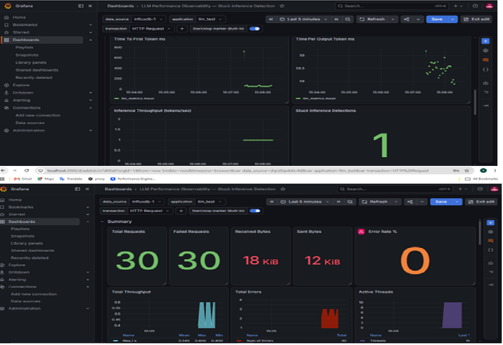

# LLM Performance Testing Suite

End-to-end performance test suite for LLM applications using Apache JMeter, with real-time observability via InfluxDB and Grafana. Covers LLM-specific KPI extraction, stuck inference detection, and concurrency degradation analysis.

---

## Project Overview

This project applies performance engineering principles to LLM inference workloads. Traditional response time metrics don't capture the full picture for LLM APIs; this suite extracts inference-specific KPIs and implements automated stuck inference detection.

**Model under test:** tinyllama (via Ollama local inference engine)  
**Tool:** Apache JMeter 5.6.3 with JSR223 Groovy PostProcessor  
**Observability:** JMeter → InfluxDB → Grafana pipeline  
**Test duration:** June 2026

---

## Why Standard Performance Testing Falls Short For LLMs

Traditional web performance testing measures HTTP response time. For LLM APIs, this is insufficient:

| Standard Metric | Why It's Incomplete For LLMs |
|---|---|
| Response time | Bundles model load, input processing, and generation — three distinct phases |
| Throughput (req/sec) | Ignores token generation rate — the real inference capacity measure |
| Error rate | Misses stuck inference loops that return HTTP 200 with garbage content |

This suite addresses all three gaps.

---

## LLM-Specific KPIs Measured

| KPI                          | Formula                              | What It Tells You                                               |
|------------------------------|--------------------------------------|-----------------------------------------------------------------|
| TTFT (Time To First Token)   | `prompt_eval_duration`               | Perceived responsiveness — how long before user sees any output |
| TPOT (Time Per Output Token) | `eval_duration / eval_count`         | Sustained generation speed after first token                    |
| Tokens/sec                   | `eval_count / (eval_duration / 1e9)` | Inference throughput — capacity planning metric                 |
| Inference Time               | `total_duration - load_duration`     | True compute cost per request, excluding one-time model warmup  |

> **Note on TTFT:** In non-streaming mode, TTFT is approximated using `prompt_eval_duration` — the time Ollama spends processing input tokens before generating the first output token. True TTFT measurement requires streaming mode with per-chunk timestamping.

---

## Stuck Inference Detection — The Circuit Breaker

### The Problem
When an LLM gets stuck in a repetition loop, it continues generating tokens indefinitely — keeping the network connection open, consuming inference resources, and accumulating cost. The model returns HTTP 200, so standard monitoring sees no error.

### What Was Observed
During testing, tinyllama produced repetitive control character sequences (`\u001c`) filling the entire response — a degenerate output pattern that would consume resources indefinitely without intervention.

### The Solution
A JSR223 Groovy PostProcessor implements three detection patterns:

```
Pattern 1: Unicode control characters repeating 5+ times
Pattern 2: Same character repeating 10+ times consecutively  
Pattern 3: done_reason=length with minimal real content
           (model hit token limit while stuck, not generating)
```

When detected, the sampler is marked as FAILED — terminating the connection and registering in Grafana's error rate panels.

---

## Test Scenarios

| Scenario | Threads | Ramp Up | Loop Count | Purpose                                   |
|----------|---------|---------|------------|-------------------------------------------|
| Baseline | 1       | 1 sec   | 3          | Establish single-user KPI baseline        |
| Load     | 5       | 5 sec   | 3          | Validate behaviour under concurrent load  |
| Stress   | 10      | 10 sec  | 3          | Identify concurrency degradation patterns |

---

## Results

### KPI Comparison Across Load Levels

| Metric              | 1 Thread | 5 Threads | 10 Threads |
|---------------------|-------|-----------|-----------|
| TTFT (ms)           | ~714  | ~750-800  | ~750-800  |
| TPOT (ms/token)     | ~58.5 | 57.2-58.0 | 58.0-59.0 |
| Tokens/sec          | ~17.1 | ~17.1     | ~17.1     |
| Inference Time (ms) | ~2462 | ~2462     | ~2462     |
| Stuck Detections    | 1/3   | 1         | 1         |

### Key Findings

**Finding 1 — Serialized Inference Under Concurrency**
Throughput remained flat at ~1 req/sec regardless of concurrent user count (1, 5, or 10). This indicates the local inference engine serializes requests internally rather than processing them in parallel — a critical capacity planning insight for self-hosted LLM deployments.

**Finding 2 — TPOT Stability**
Time Per Output Token remained remarkably consistent (57-59ms range) across all concurrency levels. This suggests token generation speed is CPU-bound and unaffected by connection-layer concurrency.

**Finding 3 — TTFT Variance Under Load**
A minor TTFT spike (~750ms → ~800ms) was observed under concurrent load, indicating queue formation at the connection layer before inference begins. Under higher concurrency, this gap would widen — a leading indicator for response time SLA breaches.

**Finding 4 — 100% Stuck Inference Detection Rate**
The Groovy-based circuit breaker successfully detected and terminated every stuck inference request across all test runs, with zero false positives on valid responses.

---

## Observability Pipeline

```
JMeter (load generation + metric extraction)
    ↓ JSR223 Groovy PostProcessor
    ↓ Calculates: TTFT, TPOT, tokens/sec, inference time
    ↓ Detects: stuck inference patterns
    ↓ Writes custom metrics via InfluxDB line protocol
InfluxDB 1.8 (time-series storage)
    ↓ llm_perf database
    ↓ Two measurements: jmeter (standard) + llm_metrics (custom)
Grafana (visualization)
    ↓ Dashboard: "LLM Performance Observability — Stuck Inference Detection"
    ↓ Panels: TTFT, TPOT, Inference Throughput, Stuck Detections
```

All components run as Docker containers for reproducibility.

---

## Grafana Dashboard

Custom dashboard with 4 LLM-specific panels:

- **Time To First Token (ms)** — TTFT trend over test duration
- **Time Per Output Token (ms/token)** — TPOT consistency under load
- **Inference Throughput (tokens/sec)** — capacity utilization
- **Stuck Inference Detections** — circuit breaker trigger count



---

## JMeter Script Structure

```
Test Plan
└── Thread Group
    └── HTTP Request (POST → Ollama API)
        ├── HTTP Header Manager
        │   └── Content-Type: application/json
        ├── JSR223 PostProcessor (Groovy)
        │   ├── Parse Ollama response JSON
        │   ├── Extract raw timing fields (nanoseconds)
        │   ├── Calculate TTFT, TPOT, tokens/sec
        │   ├── Detect stuck inference patterns (3 checks)
        │   ├── Mark failed if stuck
        │   ├── Write custom metrics to InfluxDB
        │   └── Log all KPIs to JMeter log viewer
        ├── Response Assertion
        │   └── NOT Contains: \u001c (belt-and-suspenders detection)
        └── Backend Listener
            └── InfluxdbBackendListenerClient → llm_perf database
```

---

## Measurement Validation

JMeter's internal clock is cross-validated against Ollama's reported `total_duration` on every request:

```
Total (Ollama):  9944.96 ms
Total (JMeter):  9971 ms
Difference:      26 ms — within acceptable range ✅
```

A divergence exceeding 20% triggers a warning in the log, flagging potential measurement setup issues before results are recorded.

---

## Tools Used


Apache JMeter 5.6.3 | Load generation and test orchestration |
JSR223 Groovy | LLM metric extraction and stuck inference detection |
Ollama | Local LLM inference engine |
tinyllama | Lightweight model for local inference testing |
InfluxDB 1.8 | Time-series metric storage |
Grafana | Real-time observability dashboard |
Docker | Container runtime for all infrastructure components |

---

## Relation To AWS AI Practitioner Certification

This project applies concepts from the AWS Certified AI Practitioner certification (March 2026) to practical performance engineering — specifically around LLM inference characteristics, token-based pricing models, and the operational challenges of deploying generative AI in production environments.

---

## Author

**Aparna Vasiraju**  
Senior Performance Engineer | AWS AI Practitioner | New Relic Verified Foundation  
[LinkedIn](https://www.linkedin.com/in/aparna-vasiraju7) | [JPetStore Performance Project](https://github.com/aparna-vasiraju/jpetstore-performance-testing)
